# OOAD期末复习

## UML

### 类图

> 要素：
>
> 1. 类类型和类名 \<\<interface\>\> or \<\<entity\>\>
>
> 2. 属性和方法及其修饰符：+ - \# \_ propertyName : type
>
> 3. 关系：依赖 关联 聚合 组合 继承 实现（耦合程度递增）
>
>    A依赖B 即A的对象使用B的对象，这个使用很有灵性：调方法，将B对象做参数,局部变量
>
>    **虚线箭头**
>
>    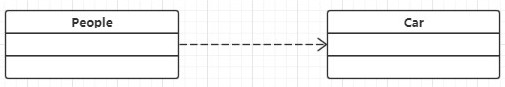{width="5.262860892388451in"
>    height="0.90667104111986in"}
>
>    A关联B 即A类包含B类 手机:华为
>
>    **实线箭头**
>
>    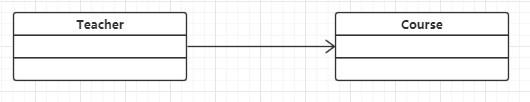{width="5.4789566929133855in"
>    height="1.0518744531933508in"}
>
>    A聚合B 即B类包含A类 而且A类B类都能独当一面 磁盘:计算机 "聚散终有时"
>
>    **实线空菱形**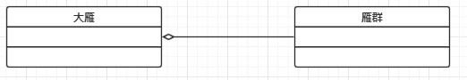{width="5.4185433070866145in"
>    height="0.9281244531933508in"}
>
>    A组合B 即B类包含A类 但A类B类不可分离 否则无法生存 翅膀:大雁
>
>    **实线实菱形**
>
>    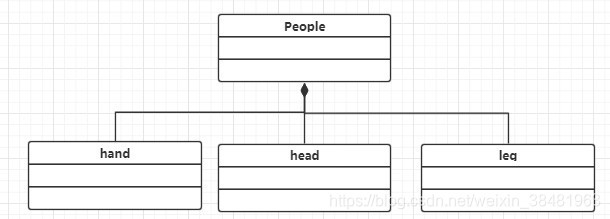{width="5.5001498250218726in"
>    height="1.9618744531933507in"}A继承B 字面意思extends**实线三角空箭头** A实现B字面意思implements**虚线三角空箭头**
>
>    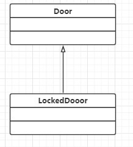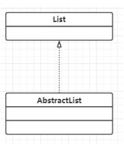

### 时序图

> 要素：
>
> 1.  角色和对象：系统使用者为角色
>
> 2.  生命线和控制焦点：控制焦点在被创建时 他的上端应该和消息持平
>
> 3.  消息：创建 返回 自关联 异步消息**实线箭头** 同步消息为**实线三角实箭头** 返回消息为**虚线箭头**

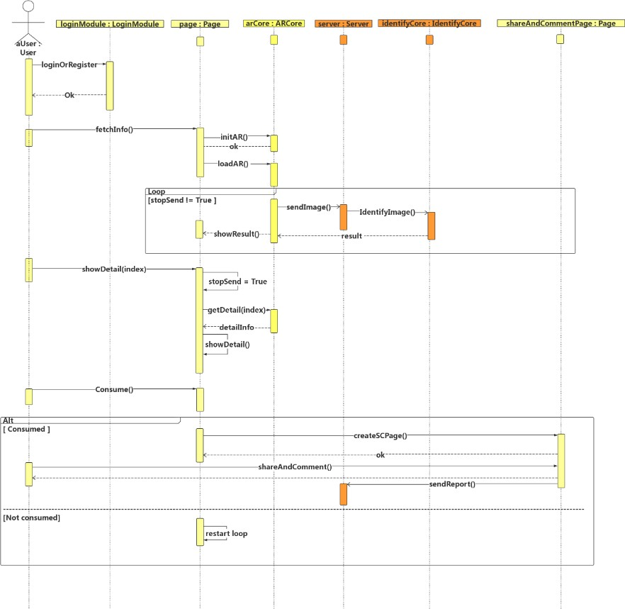{width="5.965866141732284in"
height="5.81614501312336in"}

### 用例图

> 要素：
>
> 1.  角色：使用系统的人
>
> 2.  用例：具体的系统功能
>
> 3.  关系：角色X用例：关联 角色X角色：泛化 用例X用例：包含，扩展**虚线箭头**\<\<includes\>\> \<\<extends\>\>
>
> 4.  系统容器和标签

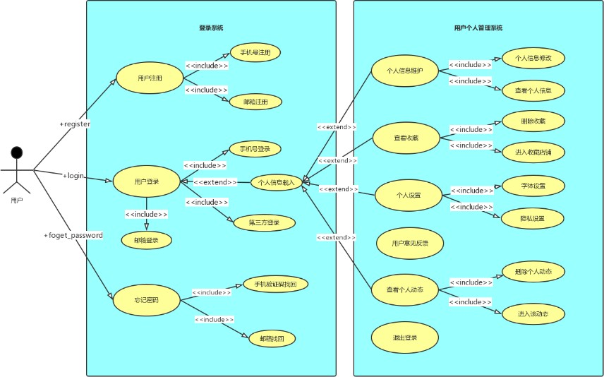{width="5.8030424321959755in"
height="3.615624453193351in"}

### 状态图

>要素：
>
>1.  节点：起终点，起点唯一终点可以有多个。状态(圆角矩形，可嵌套)，分支(菱形)
>
>2.  转换：状态图的关键：自转换，触发事件，监护条件\[\]，动作

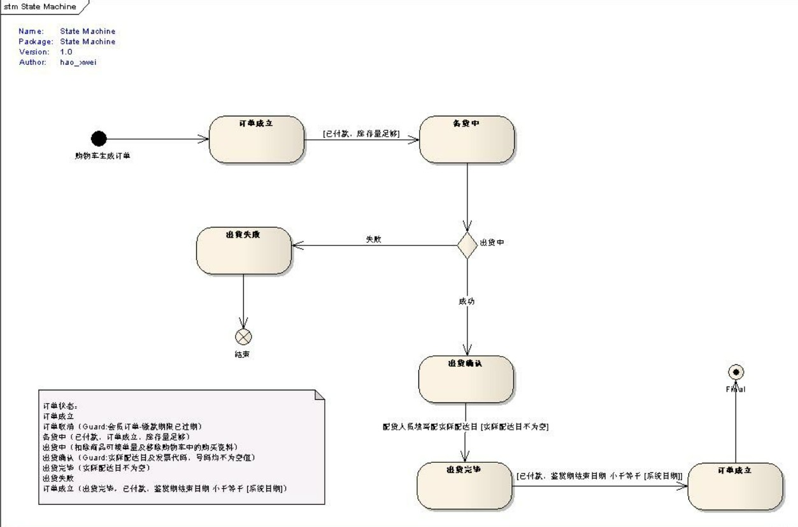{width="6.139738626421697in"
height="4.05864501312336in"}

### 部署图

> 要素：
>
> 1.  结点：结点是存在与运行时的代表计算机资源的物理元素，可以是硬件也可以是运行其上的软件系统，比如64主机、Windows server2008操作系统、防火墙等。结点实例：更具体地表示 Node Instance :node.一个结点可以包含其他节点和节点实例：结点容器。物件：软件开发过程中的产物，包括过程模型（比如用例图、设计图等等）、源代码、可执行程序、设计文档、测试报告、需求原型、用户手册等等。物件表示如下，带有关键字«artifact»和文档图标。
>
> 2.  功能程序：计算机中的功能 一个功能就画一个
>
> 3.  连接：计算机之间的连接：HTTP TCP/IP等等

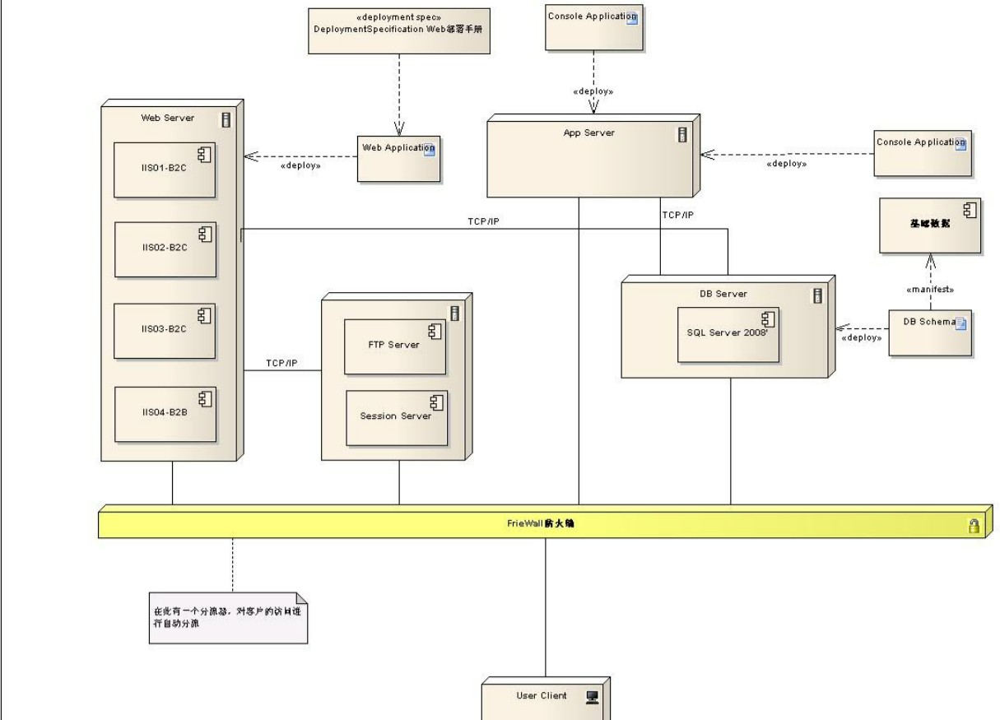{width="6.068345363079615in"
height="4.375in"}

## Design Patterns

### 简单工厂模式

要素：

>1.  工厂类：一般类，通过接受产品类型创建具体产品类
>
>2.  抽象产品类：抽象类或接口
>
>3.  具体产品类：一般类
>
>4.  产品类型：枚举类
>
>5.  客户端使用：将工厂类中的创建产品方法设置为静态方法，这样就不必创建工厂对象，客户端只需要传入产品类型即可获得对应的具体产品。
>
>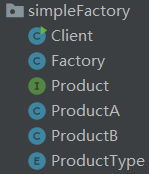{width="1.5520833333333333in"
>height="1.8125in"}
>
>

```JAVA
//客户端
public class Client {
    public static void main(String[] args) {
        Factory f=new Factory();
        Product aProduct= f.createProduct(ProductType.B);
        Product moreProduct= f.createProduct(ProductType.A);
        aProduct.aMethod();
        moreProduct.aMethod();
	}
}
//工厂
public class Factory {
    //可设置为静态方法 用类名调用
    public Product createProduct(ProductType type){
            switch (type){
            case A :return new ProductA ();
            case B :return new ProductB();
            default:return null;
        }
    }
}
//产品类型
public enum ProductType {
	A,B;
}
//抽象产品
interface
Product {
    default void aMethod(){
    	System.out.println("aMethod");
    }
}
//具体产品
public class ProductA implements Product{
	@Override
	public void aMethod(){
		System.out.println("Method of Product A");
	}
}
```

>优点：
>
>​	实现了创建对象和使用对象的职责分离，客户端无需知道创建对象的细节，只需要传入正确的对象类型就能获取到对应的具体对象，有利于软件体系结构的优化。
>
>缺点：
>
>1.  工厂类中包含了某一类抽象类的所有子类的创建，违反了高内聚的责任分配原则；
>
>2.  如果要添加新的子类，则必须改变工厂类的代码，违背了开闭原则，因此系统的拓展性和可维护性较差。

### 工厂方法模式

要素：

> 1. 抽象工厂：接口 泛型
>
> 2. 具体工厂：具体类型 一般类
>
> 3. 抽象产品：接口
>
> 4. 具体产品：实现接口 一般类
>
> 5. 客户端使用：工厂分权 具体产品对应一个具体工厂 因此先创建具体工厂
>    再用它来创建产品
>
>    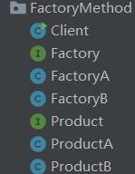{width="1.552082239720035in"
>    height="2.0in"}


```java
//client
public class Client {
    public static void main(String[] args) {
        Factory<Product> factory=new FactoryA();
        Product aProduct=factory.createProduct();
        factory=new FactoryB();
        Product moreProduct=factory.createProduct();
        aProduct.aMethod();
        moreProduct.aMethod();
    }
}
//factory
interface Factory <T>{
	T createProduct();
}
//con factory
public class FactoryA implements Factory{
    public ProductA createProduct(){
    	return new ProductA();
    }
}
//product
interface Product {
    default void aMethod(){
    	System.out.println("aMethod");
    }
}
//con product
public class ProductA implements Product{
    @Override
    public void aMethod(){
    	System.out.println("A method");
    }
}

```

> 优点：
>
> 1.  克服了简单工厂模式不易于扩展的弊端，即
>     工厂方法模式符合开闭原则，便于添加新的具体类的创建功能；
>
> 2.  具有简单工厂模式的优点，即将对象的创建过程封装在一个类中，因此客户端不需要知道具
>     体的创建过程就能创建出对应的对象
>
> 缺点：
>
> 1.  类膨胀。每出现一个新的具体对象，就要为其定义他的类和对应的工厂类，因此当系统中要考虑的具体对象太多时，系统将变得较为复杂；
>
> 2.  性能影响。由于类膨胀，因此创建对象的开销也会变大，同时，频繁地使用反射技术也会对系统性能造成影响。

### 策略模式

>要素：
>
>1.  抽象策略：接口
>2.  具体策略：实现接口 一般类
>3.  上下文：关联策略
>
>4. 客户端使用：以具体策略作为参数构造对应上下文然后执行策略
>
>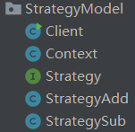{width="1.5729166666666667in"
>height="1.53125in"}

``` JAVA
//client
public class Client {
    public static void main(String[] args) {
        Context c=new Context(new StrategyAdd());
        System.out.println(c.executeStrategy(1,2));
        c=new Context(new StrategySub());
        System.out.println(c.executeStrategy(2,3));
    }
}
//context
public class Context {
    private Strategy s;
    public Context(Strategy s){
    	this.s=s;
    }
    public int executeStrategy(int a,int b){
    	return s.doStrategy(a,b);
    }
}
//strategy
interface Strategy {
	int doStrategy(int a,int b);
}
//con strategy
public class StrategyAdd implements Strategy{
    public int doStrategy(int a,int b){
    	return a+b;
    }
}
```

> 优点：
>
> 1.  策略模式提供了管理相关的算法族的办法，可以通过继承将公有的代码放到父类Strategy中,从而避免代码重复；
>
> 2.  减少了if else switch这类分支语句的使用,提高了项目的可维护性；
>
> 3.  支持开闭原则,可以在不修改原代码的情况下,灵活增加新的算法策略；
>
> 4.  实现了算法的使用和实现的分离，算法的使用放到环境类中,算法的实现放到具体策略类中。
>
> 缺点：
>
> 1.  类膨胀，每个新的算法都要为其创建对应的策略类，因此增加了系统的复杂度；
>
> 2.  客户端必须知道所有的策略类，从而才能自主决定要"实施"哪一个策略。

### 命令模式

> 要素：
>
> 1.  命令接受(执行)者:一般类 厨师
> 2.  命令调用者：关联抽象命令 前台
> 3.  抽象命令：关联接受者
> 4.  具体命令：继承抽象命令
> 5.  客户端使用：创建出服务员，然后调用服务员的方法，也就是让服务员去调用命令。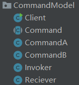{width="1.65625in"
>     height="1.78125in"}

```JAVA
//client
public class Client {
    public static void main(String[] args) {
        Reciever r=new Reciever();
        Invoker i=new Invoker();
        Command c=new CommandA(r);
        i.setCommand(c);
        i.executeCommand();
        i.setCommand(new CommandB(r));
        i.executeCommand();
    }
}
//receiver
public class Reciever {
    public void actionA(){
    	System.out.println("Cook Vegetable");
    }
    public void actionB(){
    	System.out.println("Cook Fish");
    }
}
//invoker
public class Invoker {
	private Command c;
    public void setCommand(Command c){
        System.out.println("There's new Order !");
        this.c=c;
	}
    public void executeCommand(){
        System.out.println("Waiter Record Order");
        c.execute();
    }
}
//command
abstract public class Command {
    protected Reciever r;
    public Command(Reciever r){
    	this.r=r;
    }
    abstract void execute();
}
//con command
public class CommandA extends Command {
    public CommandA(Reciever r){
    	super(r);
	}
    @Override
    void execute() {
        System.out.println("Vegetable Order committed");
        r.actionA();
	}
}
```

>优点：
>
>1.  降低系统的耦合度。命令模式能将调用操作的对象与实现该操作的对象解耦；
>
>2.  符合"开闭原则"。增加或删除命令非常方便。采用命令模式增加与删除命令不会影响其他类，易于扩展；
>
>3.  方便实现 Undo 和 Redo操作。命令模式可以与备忘录模式结合，实现命令的撤销与恢复；
>
>缺点：
>
>1.  类膨胀，使用命令模式可能会导致某些系统有过多的具体命令类，每有一个新的命令就要为其创建一个类，当命令过多时，系统中的类也会变多；
>
>2.  使用频率低、理解难度大，为了以命令的形式进行架构，解耦请求与实现，引入了额外类型结构，增加了理解上的困难，只在非常特定的应用场景下才会用到。

## 适配器模式

> 要素：
>
> 1.  适配器：把被适配的类封装进来
>     暴露出一个正常的方法，但其实这个方法调用的是奇怪的方法，这样在客户端中就不会看到奇怪的方法了。
> 2.  被适配类：第三方类 因此他在某些类似或者相同的业务处理上
>     方法名称等风格会有所不同， 需要让他融入当前的大家庭。
> 3.  其他类：只是做一个参考 展示适配器模式的使用时机
> 4.  客户端使用：创建一个适配器(xxxAdapter) 调用统一风格的api即可
>
> 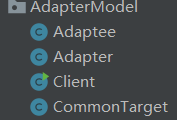{width="1.84375in" height="1.25in"}

```java
//client
public class Client {
    public static void main(String[] args) {
        Adapter a=new Adapter();
        CommonTarget c=new CommonTarget();
        a.aAPI();
        c.aAPI();
    }
}
//adapter
public class Adapter extends CommonTarget{
    private Adaptee a=new Adaptee();
    
    @Override
    public void aAPI() {
    	a.otherModelApi();
    }
}
//commonTarget
public class CommonTarget {
    public void aAPI(){
    	System.out.println("CommonApi");
    }
}
//adaptee
public class Adaptee {
    public void otherModelApi(){
    	System.out.println("adaptee api");
    }
}
```

>优点：
>
>1.  符合开闭原则，在不修改原有类代码的基础上，为其添加对应的适配器类；
>
>2.  复用性高，扩展型好。可以让本不兼容的类协作完成系统业务，十分灵活；
>
>3.  对客户端友好，不必知道被适配的类的具体逻辑，只需要调用其对应的适配器类的接口即可。
>
>缺点：
>
>1.  增加了系统的复杂度，对于每个被适配的类，都需要创建其适配器类，造成类膨胀；
>
>2.  频繁或不当地使用适配器模式容易导致代码可读性变差，使得系统凌乱不易于整体把握，比如为了定义某类的适配器类，有时有产生矛盾或者难以理解的实现逻辑。
