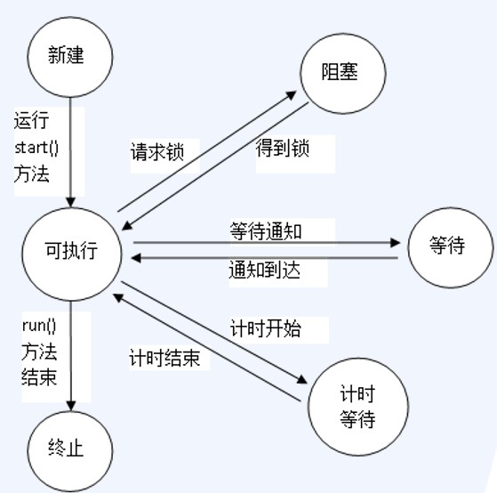
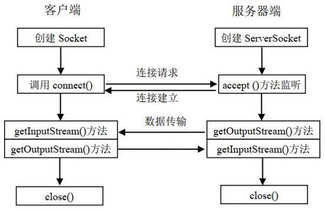
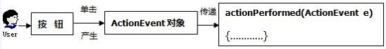
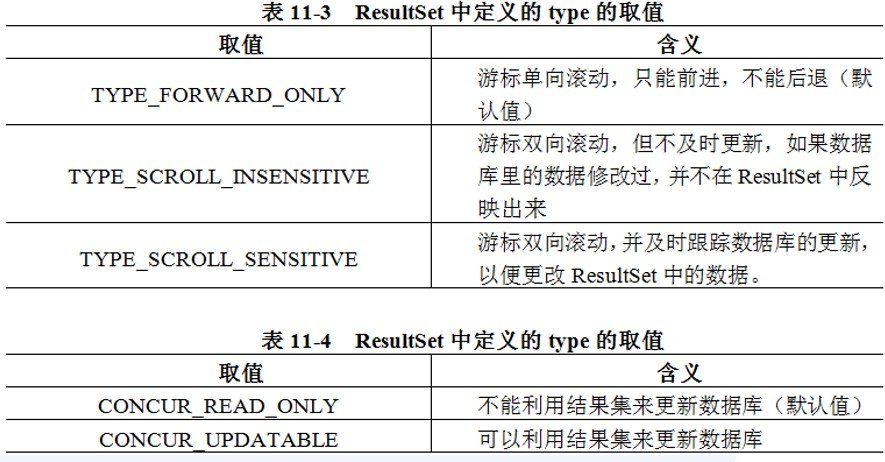

# Java期末

## OOP 

程序改错和程序分析题。侧重于OOP部分细节的理解

> - 类中静态属性和静态方法和其他属性和方法的互相访问
>
> - super this关键字的使用情形多态：重载和重写的区别
>
> - 抽象类
>
> - 接口和继承的细节差异
>
> - 内部类的类型和基本使用

### 静态

java类的生命周期中，总是先创建静态属性和静态方法，因此在创建静态属性和静态方法时，其他的属性和方法可能还没有创建出来，因此可以知道，其他类型的属性和方法可以访问静态属性和静态方法，而静态方法只能访问静态属性，对于**多个静态方法之间的互相调用**要考虑他们的执行顺序，因为在类的生成过程中，多个静态方法是按顺序生成的，同一个类中按`定义顺序`，不同类的静态方法则按类的`加载顺序`

### super this

> 不可在静态上下文中使用该关键字

1.  构造函数：用super和this引用父类或本类构造函数时，必须要将表达式作为构造方法的第一条语句,因此可以推知：super和this访问构造函数时不能同时出现在一个构造函数中，也不能有多个super或this出现在同一构造函数中，即：**this和super访问构造函数时，在本构造函数体中至多有一个会出现至多一次**
    
2.  一般引用：supe和this还可以获取被隐藏了的属性，用于继承机制中访问被隐藏了的同名变量和方法：
    
    ```java
    //父类
    public class Human(){
        ...
        //方法
        public void aMethod(){....
        	sout("i am a");
        }
    }
    //子类
    public class Man(){
        ...
        //重写父类的方法:
        public void aMethod(){
            //若父类方法中的一些步骤是必要的 或者想要复用代码 可以通过super调用同名方法(父类中的实现)
            super.aMethod();
            sout("Man");
        }
    }
    ```

### 多态

多态即：同名方法不同实现。通过**继承**的重写（覆盖）和**同一类**中的重载来完成，重载是由参数来标志的，跟返回类型无关，同名函数，同一返回类型的不同参数数量 类型 顺序为同一方法的重载。

### 抽象类

1.  abstract修饰符，只能修饰方法和类，修饰方法时 与 `static | final | private`不能同时存在 即只能是 `abstract public`

2.  抽象类的成员和方法都可以是静态和非静态的

3.  抽象类可以不包含抽象方法，可以包含非抽象方法，但包含抽象方法的类一定要被声明为抽象类

4.  尽管抽象类不能被new出来，但他仍然有自己的构造器

### 接口和继承

1.  一个类最多只能继承一个父类但却可以实现不止一个接口；

2.  接口之间也可以继承；

3.  当一个具体类实现一个接口时，应当实现该接口中，包括该接口父接口的所有方法，若无需实现，
    也需要给出空方法体。

4.  接口的方法和属性都是默认public 可以不写但不能更改，在实现接口的方法时，必须显式写出public修饰符，否则将被视为缺省的访问符，此时产生了访问权限降级，因此必须写出public！

5.  接口中的变量默认是public static final 可以不写但不能更改

6.  抽象类可以不实现接口的方法

7.  接口中的方法可以用default修饰 默认方法可以不被重写 并且可以直接调用

8.  若一个类实现了多个接口 而着多个接口存在重名方法 则只需要实现一次即可

9.  接口中可以出现重写的静态方法因为调用时也必须要加接口名和成员运算符调用
    
10. 接口没有静态代码块

11. 类和父类中的方法优先级高于任何默认方法的优先级，即当一个类继承其父类和实现接口时，当接
    口和父类中的方法重名时，将执行其父类中的方法

### 内部类

内部类根据实现场景和细节处理分为：匿名内部类 静态嵌套类 局部方法内部类

1.  内部接口只能是静态的 内部类可以是静态的

2.  内部类和内部接口不能与所在的外部类同名

3.  内部类可以实现继承 可以是抽象的

4.  内部类和其所在的外部类可以互相访问彼此的属性和方法

## IO 

在计算机系统中，数据从外部设备**流入内存**称为**输入**，反之称为输出，Java中的IO操作是以**流的形式**完成的，**流是按照一定顺序排列的，有起点和终点的数据集合**。根据方向不同分为输入流和输出流。

java.io包中的类和接口主要定义了两种类型的数据流：字节流和字符流类。他们处理的数据单位不同，前者是字节，后者是JVM将字节转化成的以2字节unicode字符为基本单位的字符，采用了统一的编码标准，更国际化。字节流可以处理任何类型的对象，包括二进制对象，而字符流只能处理字符和字符串，但是能提供更高效的操作处理方法。

IO分为四大部分

- 文件

> 1. 创建：File(String filePath)  File(File parent,String child)  File(String parent,String child) File(URI uri)
>
> 2. API:
>
>    String\[\] list(),list(FilenameFilter filter)
>    返回该目录中的所有文件名和目录名
>
>    boolean createNewFile()
>    当前抽象路径名指定的文件不存在时则创建一个空的文件
>
>    static File createTempFile(String prefix,String suffix)
>    在默认临时文件目录中创建一个临时文件 以指定的前缀和后缀命名
>
>    boolean delete() 删除当前抽象路径名指定的文件
>
>    boolean mkdir() 创建此抽象路径名指定的目录
>
>    boolean mkdirs() 创建此抽象路径名指定的目录 以及其所需但不存在父目录
>
>    boolean renameTo(File dest) 重命名此抽象路径名表示的文件

字符流和字节流的基类：Reader Writer InputStreamOutputStream都不能直接实例化对象 要用具体的子类的流实例化：FileInputStream FileOutputStream FileReader FileWriter

- 字符流

> 1. 字符输入流:
>
>    Reader:StringReader(String s) 	FileReader(String filePath)	FileReader(File f)
>
> 2. 字符输出流
>
>    Writer:StringWriter(int initialSize) 	StringWriter() 	FileWriter(String filePath) 	FileWriter(File f)

- 字节流

> 1. 字节输入流：
>
>    InputStream: FileInputStream...
>
> 2. 字节输出流：
>
>    OutputStream:FileOutputStream...


- 高级流

> 1.  转换流：就是字符流，只是将字节流转换成对应的字符流：
>     InputStreamReader(InputStream in) OutputStreamWriter(OutputStreamout)
> 2.  缓冲流:
> 3.  BufferedInputStream/BufferedOutputStream(InputStream/OutputStreamin/out,int size)
> 4.  ByteArrayInputStream(byte\[\] b,int offset,int length)ByteArrayOutputStream(int size)//size以字节为单位 默认为32
> 5.  其他流：
> 6.  RandomAccessFile(String name/File file ,String mode)=\>mode="r"/"w"分别表示读取或写入 name为指定文件名称
> 7.  SequenceInputStream
>     用来把多个输入流组成的集合作为数据源，其能够依次对多个输入流读取，直到最后一个输入流读完结束。SequenceInputStream(InputStreams1,InputStream s2) SequenceInputStream(Enumeration streamEnum)
>

## 异常

异常的类型会以填空题形式考察 try catch finally 和 throws throw的使用细节会出程序分析题

所有异常的根类为java.lang.Throwable，Throwable下面又派生了两个子类：Error和Exception，Error表示应用程序本身无法克服和恢复的一种严重问题，程序只有死的份了，例如，说内存溢出和线程死锁等系统问题。Exception表示程序还能够克服和恢复的问题，其中又分为**系统异常（运行时异常）**和**普通异常（非运行时异常）**，系统异常是软件本身缺陷所导致的问题，也就是软件开发人员考虑不周所导致的问题，软件使用者无法克服和恢复这种问题，但在这种问题下还可以让软件系统继续运行或者让软件死掉，例如，数组脚本越界（ArrayIndexOutOfBoundsException），空指针异常（NullPointerException）、类转换异常（ClassCastException）；普通异常是运行环境的变化或异常所导致的问题，是用户能够克服的问题，例如，网络断线，硬盘空间不够，发生这样的异常后，程序不应该死掉。

java为系统异常和普通异常提供了不同的解决方案，编译器强制普通异常必须try..catch处理或throws
声明继续抛给上层调用方法处理，所以普通异常也称为checked异常，而系统异常可以处理也可以不处理，所以，编译器不强制用try..catch处理或用throws声明，所以系统异常也称为unchecked异常。

创建一个异常对象并把它送到运行系统的过程就是抛出异常。语法格式：throw new 异常类名（提示信息）

创建自己的异常类时需要继承Exception

## Thread

填空题 程序分析题 程序改错题都可能出现

有关线程的基本概念：**线程状态**和**创建线程类**的基本步骤会以填空题形式考察

有关于线程同步 线程中止 守护线程会作为程序分析题和改错题考察具体实现细节

### 线程状态

> {width="5.822916666666667in"
> height="5.770833333333333in"}


### 创建线程类

1.  继承Thread类 继承 重载run 创建 start

2.  实现Runnable接口 然后将该类的对象作为构造参数 new一个Thread类，再利用new出来的该Thread类对象start

### 线程同步

1.  synchronized

> 用该关键字修饰代码块或方法,保证在代码调用该方法和执行该代码块时，最多只有一个线程能访
> 问。

2.  ReentrantLock类

> 多个线程的同步可以通过ReentrantLock对象调用newCondition()方法生成的condition对象来控制，满足条件的线程即可执行，其余线程进入等待状态(condition.await())，当条件改变时，唤醒(condition.signalAll())所有等待状态的线程并重新检测条件.

```JAVA
public class SynUtil{
	public static ReentrantLock lock=new ReentrantLock();
	public static Condition condition=lock.newCondition();
}
public class test extends Thread {
	@override
	public void run(){
		while(true){
    		SynUtil.lock.lock(); //调用lock的lock方法 获得锁
			try{
				if(xxx)
					SynUtil.condition.await();
				/*do something tile the condition change*/
				SynUtil.condition.signalAll();
			}catch{Exception e}
			finally{
				SynUtil.lock.unlock();//释放锁
			}
		}
	}
}
```


### 线程中止

想要中止某个线程t，则调用t.interrupt();然后在t线程中的循环添加(!Thread.currentThread().isInterrupted()&&xxxx),注意，当t线程可能处于阻塞态或计时等待态时，执行t.interrupt()会抛出异常，因此需要为t的run重载的逻辑部分添加try catch

### 守护线程

守护线程（Daemon Thread）是指程序运行在后台提供服务的线程，此类线程并不属于程序中不可或缺的部分。因此，当所有的非守护线程结束后，程序结束并终结所有守护线程。反过来讲，只要任何非守护线程还在运行，程序就不会终止。计时器（Timer）线程是典型的守护线程，它的存在就是为其它线程提供计时服务，该线程本身并无明确的终止条件，当主线程结束后，作为守护线程，它会被自动终止。需要注意，绝对不要在守护线程中访问文件或数据库等持久化资源，因为守护线程可以在任意时刻被终止，有可能对持久化资源造成错误的修改。调用setDaemon(true)方法可以将一个线程设置为守护线程。

## Socket

C-S工作模式：

网络通信需要通信双方来来协调完成，通常我们把主动提出网络通信请求的一方称为客户端，而被动等待其它主机提出请求才作出相应的一方称为服务器端。

服务器端运行服务程序**循环等待并监听**有无客户端向其提出通信请求，如果有客户端向其提出请求连
接，则立刻作出响应，因此服务器端也可以理解成提供服务的一端，而客户端为使用服务器端提供的服务。

客户端通信流程：

客户端指的是主动向对方提出连接请求的一端，客户端通信的过程如下

1.  创建Socket套接字

2.  通过Socket套接字向服务器端提出连接请求

> 客户端通过调用Socket对象的connect() 方法向服务器端提出请求。

3.  通过Socket套接字和服务器端建立输入输出流

> 客户端通过调用Socket对象的getInputStream()和getOutputStream()方法获取输入和输出流。

4.  按照协议向套接字进行读和写操作

> 通过第（3）步所获取到的输入输出流，结合输入输出流完成数据的读写操作。

5.  关闭套接字

> 通过调用Socket对象的close()方法关闭套接字。

服务端通信流程：

1.  创建套接字ServerSocket

2.  使服务器端套接字处于监听状态

> 服务器通过ServerSocket对象的accept() 方法对网络进行监听。

3.  为套接字创建输入和输出流

> 监听到客户端的连接请求并实现连接后，通过accept()方法获取到一
> 个Socket对象，再通过其getInputStream()和 getOutputStream()方法获取输入和输出流。

4.  按照协议向套接字进行读和写操作

> 通过第(3)步所获取到的输入输出流，结合输入输出流完成数据的读写操作。

5.  关闭套接字

> 通过调用ServerSocket对象的close()方法关闭套接字。


{width="5.729166666666667in"
height="3.7083333333333335in"}

TCP,UDP:

TCP和UDP是网络体系结构中运输层的两个协议，能够提供两个主机的两个应用进程之间的通信。
TCP协议提供面向连接的可靠的数据传输服务，在双方传送数据之前需先建立连接，数据传递结束后需释放连接。TCP不提供广播或多播服务。由于TCP提供可靠的连接服务，会增加开销，因此适合于对双方通信质量要求较高，但实时性不强的场合，比如交互式通信。

UDP协议提供面向无连接的基于数据报交互的数据传输服务，通信双方在通信前不用建立连接，发送方根据对方的ip等地址信息和要发送的数据，封装成数据包发送给对方，接收方收到数据报后不需要回复。UDP协议虽然不提供可靠的通信服务，但减少了开销，适合于对通信质量要求不很高，但对实时性要求较高的场合，比如网络多媒体传输。

URL:

URL(Uniform Resource
Locater)是统一资源定位符的简称，能表示网络中资源的位置，这个资源可以是一个文件或目录，也可以是一个数据库。在计算机网络中通过资源的URL地址，则可以对其进行访
问。常见的网址就是一个典型的URL。

URL通常由４个部分构成，常见格式如下： 传输协议：//主机名：端口号/文件名

> 通过URL对象的 openStream() 方法只能实现对资源信息的读取，URL对象的openConnection() 方法可以获得一个URLConnection对象，该对象不仅可以从资源中读取数据，还可以向资源中写入数据。
> 

## AWT

主要考察两部分：事件机制 和 布局管理事件机制极有可能出填空题

### 事件机制

概念：

事件源：触发事件的图形组件，如标签，按钮，文本框等。

事件：用户对事件源进行的**操作**叫做事件。如单击按钮，文本框中按回车键，双击列表框，选中菜单项等。事件都对应一个事件类的实例。如单击按钮，将产生ActionEvent事件类的对象。

事件接收：Java为每个事件类定义一个事件监听器接口(implements)，并约定了事件处理方法(override)。

事件处理：在接收---处理环节，系统一旦监听到事件发生，就把该事件交给对应的事件处理方法(actionPerformed())，进而完成用户的操作目标。

例如，在某信息系统的登录界面，用户用鼠标单击了按钮button，那么事件源就是button按钮。单击button就会产生ActionEvent事件类的对象，其中包含有该事件的名称、来源等信息。系统把这个事件对象交给对应的方法去处理，该方法就是actionPerformed()，ActionEvent事件类的对象e作为该方法的
参数。

{width="4.791665573053368in"
height="0.8020833333333334in"}{width="5.822916666666667in"
height="0.7395833333333334in"}

GUI开发中，事件处理的设计包含以下4步：

(1) 导入java.awt.event包； `import java.awt.*`

(2) 实现监听器接口；` implements ActionEvent`

(3) 将事件源注册给事件的监听者；` xxx.addActionListener(this)`

(4) 具体实现监听器接口所约定的事件处理方法`@override public void
actionPerformed(ActionEvent e){xxx}`

### 布局管理

布局管理器用于设置容器中各个组件的位置、大小、排列顺序以及组件间隔等；
包含组件的容器发生了位移或改变大小，组件相应变化由它来解决；

> 它主要有FlowLayout 、 BorderLayout 、 GridLayout 和CardLayout 等类型。

**FlowLayout**布局也称作流式布局；它把组件从左到右，一行一行地排列，一行放满后另起一行。若某行组件未放满，则把组件居中放置在该行中间；容纳组件的容器大小发生改变时，FlowLayout布局管理器可以调整组件的相对位置，使得组件排列在一行或多行。

**BorderLayout**中，容器被划分成东、西、南、北和中部5个区域；由常量BorderLayout.EAST、BorderLayout.WEST、BorderLayout.SOUTH、BorderLayout.NORTH和BorderLayout.CENTER表示；容器的每个区域只能添加一个组件。添加后该组件将占满这个区域；东、西、南和北4个区域中若出现哪一个未使用，则该区域归零，并且被中部区域所吞并；

**GridLayout**称作网格布局，它展现为几行几列的网格区域；
组件需要被依次放入其中，一个组件要占一格；网格大小完全相同，并且要求组件大小与网格一致；

**CardLayout**布局为选项卡风格； 它将组件处理为若干选项卡；程序一运行，将显示首个选项卡。其余选项卡既可以按照顺序逐一显示，也可以由操作人员指定显示。每个选项卡都有一个标记，点击此标记则显示相应选项卡下的组件。

## JDBC

编程题 重点在于应用

### 连接

连接具体步骤有：

1. 导入mysql.connector的jar包

2. import java.sql.\*

3. 三要素 `url=("jdbc:mysql://localhost:3306/xxx") username password`

4. 反射注册驱动 `Class.forName("com.mysql.jdbc.Driver")`

5. 由驱动管理器建立连接

   `Connection con=DriverManager.getConnection(url,username,password);`

### CRUD

连接好数据库后：

1. 创建statement对象 Statement s=con.createStatement();

2.  编写sql语句并用statement对象执行 String sql="xxxx";s.executeXXX(sql);
    
3.  接收结果：增删改影响行数:int rows=s.executeXXX(sql);查询结果集：ResultSet rs=s.executeQuery(sql);
    
4. 展示查询结果

   ```JAVA
   while(rs.next()){
   	String resultType1=rs.getString("property1");
   	int resultType2=rs.getInt("property2");
   	sout(resultType1+...+);
   }
   ```

   

5. 关闭资源，当执行完业务后一定要记得关闭资源,关闭一个资源对象后，该资源对象创建的所有资源也将被关闭。因此只需要关闭connection对象：con.close();

### 异常处理

访问数据库过程中可能产生SQLException异常，因此我们需要处理这些异常，异常处理不当将会造成JDBC对象无法关闭，造成系统资源浪费(用try catch finally编写，finally中关闭资源)。

```JAVA
try{
	Connection c=DriverManager.getConnection(url,username,password);
	try{
		Statement s=c.createStatement();
		ResultSet rs=s.executeQuery(sql);
		...
	}
	finally{
		c.close();
	}
}
catch(Exception e){
	//处理
	e.printStackTrace();
}
```

### 元数据

除了查询表中的数据之外，JDBC还提供了表结构信息、数据库信息的功能，这类信息称metadata，
即关于数据的数据。例如如数据库中共有多少个表，每个表中共有几个字段，每个字段的名字是什么等等，这些信息都是metadata。

DatabaseMetaData db = con.getMetaData();	//con是Connection对象

ResultSetMetaData table = rs.getMetaData();	//rs是ResultSet对象

> 举例：使用root账号连接位于本机的jdbc数据库，打印显示数据库中全部表结构，接收井执行用户输入的指令。若用户输入select语句 则显示查询结果 若输入update insert delete语句 则打印语句影响的行数 若输入exit 则程序正常结束 若用户输入非法指令 则结束程序并打印显示捕捉到的异常。

```java
package JDBC_Review;

	/*
	* @author :springbear
	* @description :
    */

import java.sql.*;
import java.util.Scanner;

public class instance {
	public static void main(String[] args) {
	//三要素
	String url1="jdbc:mysql://localhost:3306/jdbc_S";
	String username="root";
	String password="zyq2004zyq";
        
	try {
		//注册驱动
		Class.forName("com.mysql.jdbc.Driver");
		//获取连接
		Connection c= DriverManager.getConnection(url1,username,password);
		System.out.println("db connected");
		try {
			//获取Statement对象
			Statement s=c.createStatement();
			//获取表结构
			DatabaseMetaData databaseMetaData=c.getMetaData(); //数据库
			ResultSet tables=
databaseMetaData.getTables("jdbc_S",null,null,new String[] {"TABLE","VIEW"});//数据库中的表
			ResultSetMetaData columns=null;//表中的属性
			ResultSet rs=null;//接收 *查询语句返回的数据
			String tableName=null;//表名
			StringBuilder table_mode=new StringBuilder();
			//输出所有表名 和 对应的属性 并按照规范输出 TABLE(SS,XX,YY);
			while(tables.next()){
				tableName=tables.getString("TABLE_NAME");
                rs=s.executeQuery("select * from user");
				columns=rs.getMetaData();
				table_mode.append(tableName);
				table_mode.append("(");
				table_mode.append(columns.getColumnName(1));
				for(int i=2;i<=columns.getColumnCount();i++){
					table_mode.append(",");
					table_mode.append(columns.getColumnName(i));
                }
				table_mode.append(");");
				System.out.println(table_mode);
				table_mode.delete(0,table_mode.length());
			}
			System.out.println("input sql");
			Scanner in =new Scanner(System.in);
			String command=in.nextLine();
			while(command.toLowerCase().equals("exit")==false){
				boolean flag=s.execute(command);
				if(flag==false){
					int n=s.getUpdateCount();
					System.out.println("Effect "+n);
				}else{
					rs=s.getResultSet();
					columns=rs.getMetaData();
					int count=columns.getColumnCount();
					for(int i=1;i<=count;++i)
						System.out.print(columns.getColumnLabel(i)+"\t");
						System.out.println();
						while (rs.next()){
							for (int i=1;i<=count;i++)
								System.out.print(rs.getObject(i)+"\t\t");
							System.out.println();
						}
						System.out.println("next command:");
						command= in.nextLine();
					}
				}
				System.out.println("farewell");
			} finally {
				c.close();
			}
		}catch (Exception e){
			e.printStackTrace();
		}
	}
}
```


### 预编译

使用 PreparedStatement 比使用 Statement 的好处

- 无须"拼接"SQL语句，编程更简单

- 预编译 SQL 语句，性能更好（MySQL 不支持 PreparedStatement 的性能优化）

- 可以防止 SQL 注入，安全性更好

```java
String sql="select id from user where name=? and password=?";
PreparedStatement ps=con.preparedStatement(sql);
ps.setString(1,name);
ps.setString(2,password);
ResultSet rs=ps.exexuteQuery(); //executeQuery不需要再绑定sql语句 因为ps本身就由sql语句创建出
```

### 增强结果集

在创建Statement或PreparedStatement对象时，执行相应参数可使结果集获得自由滚动和更新数据库的能力。

Statement stat = conn.createStatement(type, concurrency);

PreparedStatement stat =conn.prepareStatement(command, type, concurrency);
type和concurrency参数的取值均是ResultSet类中事先定义好的常量

{width="6.174291338582677in"
height="3.224374453193351in"}

> rs.previous() 		 	//向后滚动1条记录
>
> rs.relative(n)		 	//如果n为正整数，则向前滚动n条记录；反之则向后滚动
>
> rs.absolute(n)	  	//绝对定位到第n条记录
>
> rs. first() 			  	//滚动到第一条记录
>
> rs.last() 	 	 	 	//滚动到最后一条记录
>
> rs. beforeFirst()  	//滚动到第一条记录之前，不指向任何记录
>
> rs.afterLast() 	 	//滚动到最后一条记录之后，不指向任何记录

```java
//第三行记录的密码改为“hello”
rs.absolute(3); //绝对定位到第3条记录
rs.updateString("password ", "hello "); //将该记录的password字段更新为“hello”
rs. updateRow(); //提交更新
...
//插入一条记录(4, lucy, 9527)
rs. moveToInsertRow(); //将游标移动到“插入行”的位置
rs. updateInt(1, 4); //将第一个字段的值设置为4
rs. updateString(2, "lucy"); //将第二个字段的值设置为“lucy”
rs. updateString(3, "9527"); //将第三个字段的值设置为“9527”
rs.insertRow(); //将新纪录插入表中
rs.moveToCurrentRow();//将游标回归到原位置
//删除最后一条记录
rs.last();
rs.deleteRow();
```

### 事务

事务(Transaction)是数据库管理系统执行过程中的一个逻辑单位，由一个有限的数据库操作序列成。
事务具有原子性、一致性、隔离性、持续性四大特点。若事务顺利执行完毕，则通过commit方法提交。若事务运行的过程中发生了故障，则通过rollback方法回滚，系统将事务中已完成的操作全部撤消，回滚到事务的最初状态。

在JDBC中，默认情况下事务是自动提交的，即每条SQL语句都单独构成一个事务，执行完毕后立刻提交到数据库。若要将多条语句组成一个事务，必须调用Connection对象的setAutoCommit(false)方法，将自动提交修改为手动提交。事务结束后，调用Connection对象的commit()方法提交到数据库。若事务执行过程中发生故障，则需在处理异常的catch块中调用Connection对象的rollback()方法，回滚到初始状态。

```java
Connection conn = null;
	try {
		Class.forName("com.mysql.jdbc.Driver");
        conn = DriverManager.getConnection(mysql_url, name, password);
        conn.setAutoCommit(false);
        Statement stat = conn.createStatement();
        stat.executeUpdate(command_1); //更新语句1
        stat.executeUpdate(command_2); //更新语句2
        ……
        stat.executeUpdate(command_n); //更新语句n
        conn.commit();
	}
	catch (Exception ex) {
        ex.printStackTrace();
        try {
        	conn.rollback();
        }
        catch (Exception e) {
        	e.printStackTrace();
		}
	}
```

### 行集

增强的结果集功能已十分完善，但仍有一个严重的缺点，即在整个操作过程中必须一直占用数据库的连接，这使得结果集缺乏足够的灵活性，并且许多操作都在数据库服务器完成，没有充分利用客户机的计算资源。行集(RowSet)继承了ResultSet接口，却又无需一直占用数据库连接。

RowSet扩展了ResultSet接口，既能使用ResultSet中所有功能，又添加了新功能。默认情况下RowSet
对象都是可滚动的和可更新的。

大部分RowSet是非链接的，可以离线操作数据。

RowSet接口添加了对 JavaBeans 组件模型的 JDBC API 支持，可作为JavaBeans组件使用在可视化Bean 开发环境中。

某些RowSet是可以序列化的。

MySQL官方驱动不含对行集的实现，只能在Sun公司的com.sun.rowset.CachedRowSetImpl提供的参
考实现。

> CachedRowSet 
>
> WebRowSet
>
> FilteredRowSet
>
> JoinRowSet
>
> JdbcRowSet
